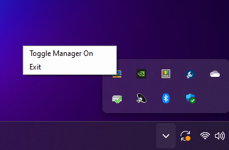

# Xinput Windows Manager

## About

This system tray Windows 10 application allows the user to toggle a mouse mode by pressing a special button combination on an Xinput gamepad such as the Xbox One Controller. In this mode, the gamepad is able to freely move the cursor around the screen, perform left and right click actions as well as some useful keyboard presses.

The software was developed so that users with a desktop setup with only gamepad input or at least inconvenient access to keyboard and mouse can perform basic tasks that require these input methods using a gamepad. An example would be my case, where I use a desktop PC with Steam Big Picture in my living room as a DIY game console.

## Installation

1. Download the lastest release of this software in the [official github page](https://github.com/urbanoanderson/xinput-windows-manager/releases);
2. Extract the contents of the zip file. You can run the main executable file at anytime to start the app;

Optional - If you want the app to start with windows do the following:
1. Create a shortcut of `"XinputWindowsManager.exe"`
2. Place the shortcut inside the following folder: `"C:\Users\<YOURUSERNAME>\AppData\Roaming\Microsoft\Windows\Start Menu\Programs\Startup"`

## Usage

You can toggle mouse mode by right-clicking the system tray icon and selecting the toggle option or by pressing the following button combination on your xinput controller (player one):
- `BACK` + `A` + `X`

While in mouse mode, the following actions can be performed:
- `Left analog stick`: controls mouse cursor movement;
- `A`: performs left click;
- `X`: performs right click;

## Release Notes

### 1.0.0

- Initial version
- Enables mouse movement, left and right click actions

## Acknowledgements

<a href="https://www.flaticon.com/free-icon/laptop_1577244" title="Kiranshastry">Icon</a> made by Kiranshastry from <a href="https://www.flaticon.com/" title="Flaticon">www.flaticon.com</a>
